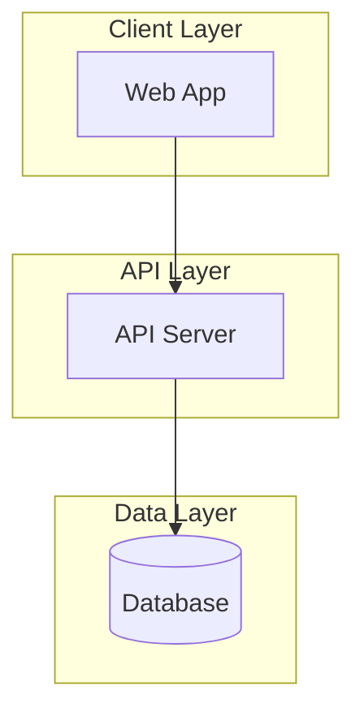
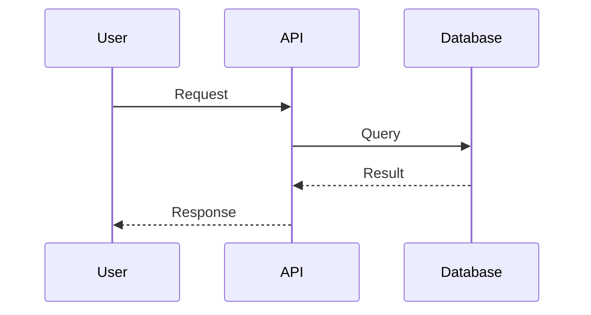

# {Project Name} Architecture

**Status:** Draft | Approved | Implemented
**Last Updated:** YYYY-MM-DD

---

## Overview

### What This System Does

{One paragraph explaining the system's purpose in plain language.}

### Key Constraints

- **Scale target**: {X concurrent users / Y requests per second}
- **Deployment**: {Where and how it runs}
- **Team**: {Who maintains this}

---

## High-Level Components

### Component Diagram

### Component Responsibilities

| Component | Responsibility | Tech |
|-----------|---------------|------|
| {Component} | {What it does} | {Technology} |

---

## Data Flow

### Primary User Flow

{Describe the main data flow in 2-3 sentences.}

### Key Data Entities

| Entity | Purpose | Stored In |
|--------|---------|-----------|
| {Entity} | {Purpose} | {Storage} |

---

## Key Decisions

### Decision 1: {Title}

**Context**: {What situation prompted this decision?}

**Decision**: {What we chose and why.}

**Trade-offs**: {What we gave up, what we gained.}

---

## What We're NOT Doing (and Why)

| Pattern/Feature | Why Not |
|-----------------|---------|
| {Pattern} | {Justification} |

---

## Future Considerations

Things that might matter later but don't need solving now:

- **If {condition}**: {What to consider}
